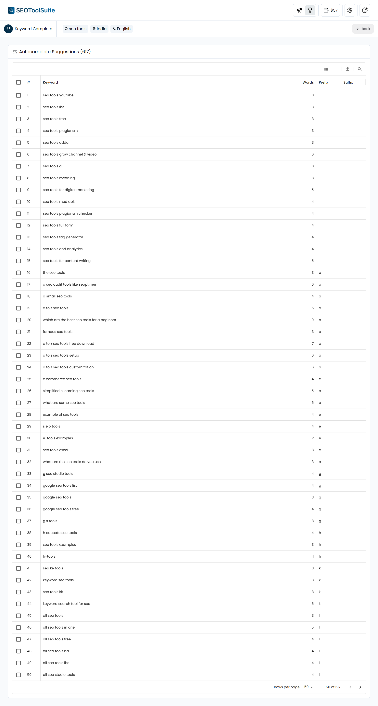

SEOToolSuite provides **free and open source SEO tools for everyone**. Keyword research and more, powered by DataForSEO.

[](https://github.com/nitishkgupta/seotoolsuite/releases) [](LICENSE) [
](https://seotoolsuite.nitishkgupta.com)

## 🔍 SEO Tools

### Keyword Research


Find thousands of keyword suggestions with multiple metrics like search volume, trend, search intent, seo difficulty, and more. Uses DataForSEO APIs.

### Keyword Complete



Generate hundreds (or even thousands!) of long-tail keywords for free using Google autocomplete. No API needed!

### Robots.txt Analyzer

Fetch and analyze a website's robots.txt file. Returns:
- Disallowed and allowed paths per user-agent
- Sitemap URLs
- Issues (missing, malformed entries, etc.)

**Usage (Module):**

```typescript
import { RobotsTxt } from "@/services/RobotsTxt";

const robotsTxt = new RobotsTxt();
const result = await robotsTxt.analyze("example.com");

console.log(result.status);      // "found" | "missing" | "unreachable" | "error"
console.log(result.userAgents);  // Array of user-agent sections
console.log(result.sitemaps);    // Array of sitemap URLs
console.log(result.issues);      // Array of issues found
```

**Usage (API):**

```bash
curl -X POST http://localhost:3000/api/robots-txt \
  -H "Content-Type: application/json" \
  -d '{"domain": "example.com"}'
```

## 📋 Prerequisites

- [DataForSEO API](https://dataforseo.com/?aff=44560) (for tools using DataForSEO APIs)
- Node.js (for localhost/server deployment)

## 🚀 Getting Started

You can use the cloud version of SEOToolSuite for free or run it on your localhost/server as well.

### Using The Cloud Version

Simply head to [https://seotoolsuite.nitishkgupta.com](https://seotoolsuite.nitishkgupta.com), and use the tools right-away!

### Running On Localhost/Server

#### 1. Clone the repo.

```bash
git clone https://github.com/nitishkgupta/seotoolsuite.git
```

#### 2. Install dependencies.

```bash
npm install
```

#### 3. Build the app.

```bash
npm run build
```

#### 4. Start the app.

```bash
npm run start
```

## 🔄 Getting Updates

The cloud version is updated automatically. For the local version, follow the below steps:

### 1. Pull the latest changes from the repo.

```bash
git pull
```

### 2. Install dependencies.

```bash
npm install
```

### 3. Rebuild the app.

```bash
npm run build
```

### 4. Start the app.

```bash
npm run start
```

## 🛠️ Tech Stack

- Next.js

## ℹ️ Frequently Asked Questions

### 1. Are my API credentials secured?

Yes, your API credentials are stored locally in your browser (via LocalStorage) and are never sent to any server.

### 2. Are these SEO tools free to use?

Yes, you only pay for your API usage (DataForSEO). There are no extra or hidden charges.

### 3. Can I reuse the code?

Yes, the entire codebase is licensed under the MIT License, so you’re free to use, modify, and reuse the code as you wish.

### 4. Where do I report bugs or request features?

If you’ve found a bug or have a feature suggestion, please open an [issue](https://github.com/nitishkgupta/seotoolsuite/issues). Your feedback is always welcome!

## 📝 Changelog

The changelog is available [here](CHANGELOG.md).
